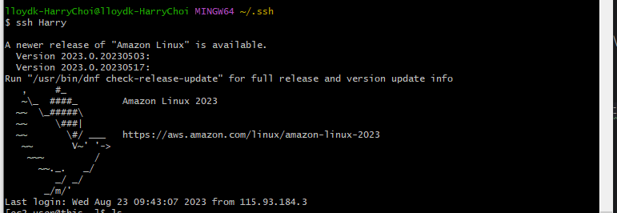

## 3일차

### 이번 주 목표
#### 1주차 로이드 케이에 대한 전반적인 소개
#### [자신이 소속한 부서에 대한 명확한 업무](#명확한-업무)
#### 긍정적인 마인드, 장래 커리어 명확한 설계

---------------------------------------------------
#### 명확한 업무
데이터 구축 및 유지보수 >> ElasticSearch, Kafka\
클라우드 구축 및 유지보수 >> Terraform, Valut

### AWS
어제 집에있던 pem키를 가져와서 aws 설치를 완료하였다.

--------------
#### 새로 알게 된 기능
오늘 Swit 카드를 추가 시켰다.
카드 버킷도 이름이 변경 가능하다.