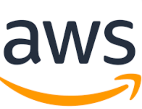
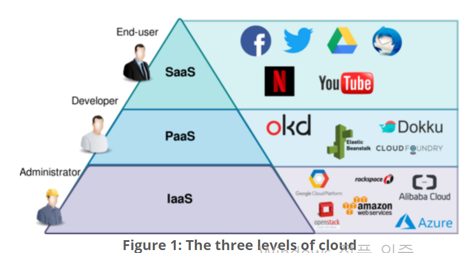

## Cloud란 무엇인가?

### GCP/AWS/Azure 차이점 비교 하기
\
GCP > Google cloud
무료 버전 모두 이용함.

\
AWS > 아마존 웹서비스
프리티어 이용중 (인스턴스 새로 만들어야.. 비용 청구됨)\
\
Azure

###  사용 방법과 설정 방법 확인
 각각의 환경에서 인스턴스 구성해 보기

aws의 경우 일단 윈도우에서 git bash를 다운받고 명령어를 이용하여
mkdir ~/.ssh 폴더를 만든다.

vim config 파일을 만들고

  Host 서비스명\
    UserName (ec2의 탄력적 IP주소)\
    User 호스트 사용자명\
    IdentityFile ~/.ssh.키페어pem

이렇게 작성한다.

`chmod 400 키페어.pem`

`ssh -i "키페어.pem" 호스트네임@탄력적 주소`
로 작성해서 pem 권한 설정하고 ssh 호스트네임 입력해주면 끝

[참고링크](https://dev-coco.tistory.com/107)

### IaaS/PaaS/SaaS란 무엇인가?

인프라형 서비스 / 플랫폼형 서비스 / 소프트웨어형 서비스

### On-premis와 VM 차이점은 무엇인가?
온프레미스는 클라우드서비스를 이용하지 않고 사내전산실을 통해 직접 설치 이용\
  VM은 가상머신으로 가상으로 된 환경에서 os를 설치하여 사용하는 방식

