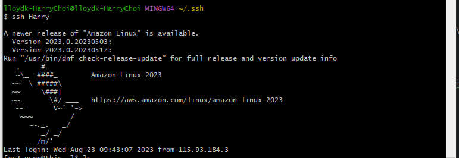

## 3일차

> 이번 주 목표
#### [1주차 로이드 케이에 대한 전반적인 소개](https://wiki.lloydk.co.kr/pages/viewpage.action?pageId=3474398)
#### 자신이 소속한 부서에 대한 명확한 업무
#### 긍정적인 마인드, 장래 커리어 명확한 설계

---------------------------------------------------

### ***오상철 부장님 인프라 교육***
개발/ 테스트/ 운영/ 재해복구는 ON-premise에서 진행\
각 운영을 위해 Web, WAS, DB를 사용했다.

안에서 파트가 중단이 되더라도 장애가 발생하지 않도록 HA사용 (고가용성, 무중단 배포)

| 개발  | 테스트 | 운영 | 재해복구 |
|------------|-----|----|------|
| WEB/WAS/DB |WEB/WAS/DB  |WEB/WAS/DB    |WEB/WAS/DB |

서버를 키우기 위해 HW위에 OS를 설치하고 VM를 사용했었다. (제한된 환경)

| SW -> VM |
|----------|
| OS       |
| HW       | 

| SW -> VM |
|----------|
| OS       |
| HW       |

...

ON-premise에서 (서버 전산실) 클라우드로 넘어가는 추세 
> [IaaS,PaaS,SaaS](https://github.com/JaeKang20/lloydk/blob/main/1%EC%A3%BC%EC%B0%A8/Cloud%EB%9E%80(2%EC%9D%BC%EC%B0%A8).md)

## 오늘의 미션

**상황**: ec2인스턴스, docker등 여러 아이디어 제시, 멘토링 커리큘럼처럼 VM을 설치하고 했으면 좋겠다는 의견(Jisoo)수용

**Task**: VM,OS,S/W 설치 (조건: 동기들과 같은 환경으로 해보기)

> [VM설치 방법](https://dear-sauce-d4e.notion.site/Vmware-centos-7-383912d791b34899aa4d9d782ab44998)

**액션**: VM 설치 이후 Cent OS를 설치\

**결과**:\

### ***번외편 AWS***
어제 **Cloud란 무엇인가?** 를 예습하면서\
AWS 인스턴스를 설치하기 위해 집에있던 pem키를 가져와서 aws 인스턴스 설치를 완료하였음.

\
완료된 모습

--------------

#### 새로 알게 되거나 해본 기능
- 오늘 Swit 카드 추가 (예비군 공가)
- 카드 버킷 이름,상태,컬러 변경
- 오상철 부장님 캘린더 구독