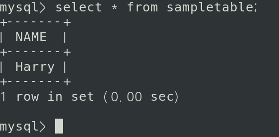

### 6일차
(2023.8.28)

> 이번 주 목표

1. 담당 업무의 회사 생활에 필요한 전반적인 제반사항을 숙지하고 폭 넓은 대인관계를 위한 기틀을 마련
2. 제품 전반에 대한 개념을 습득한다.

-----
#### 동기 입사
박다혜님 컴퓨터 세팅 및 회사 소개

------

### 클라우드 공부 (개인 공부)
[OT링크](https://github.com/JaeKang20/lloydk/blob/main/%ED%81%B4%EB%9D%BC%EC%9A%B0%EB%93%9C/OT.md)\
[클라우드 컴퓨팅기초](https://github.com/JaeKang20/lloydk/blob/main/%ED%81%B4%EB%9D%BC%EC%9A%B0%EB%93%9C/%ED%81%B4%EB%9D%BC%EC%9A%B0%EB%93%9C%20%EC%BB%B4%ED%93%A8%ED%8C%85%20%EC%9D%B4%ED%95%B4.md)

------
### Mysql
Linux환경에서 Mysql설치해보기

[Mysql 참고 링크](https://dear-sauce-d4e.notion.site/mysql-e49ef2705c144d5b984fcded2d69de31)

------
### Apache Kafka

실전 카프카 개발부터 운영까지 개인 **9월 22일까지** hands on

내 일정을 내가 어떻게 잡을지 고민,\
동기와 내가 원하는 바가 무엇인지 구체적으로 알고 커뮤니케이션이 중요하다.

누가 어떤 팀을 할지 합의를 이루세요.\
기술적인걸 원하는게 아니라 내가 이걸 통해 해왔던것들, 아쉬웠던것들을 가지고

아마추어와 프로의 차이
: 질문과 보고을 성실히 Notiece, 책임감을 가져서