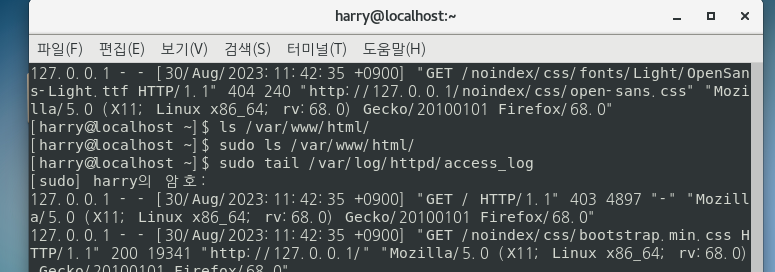
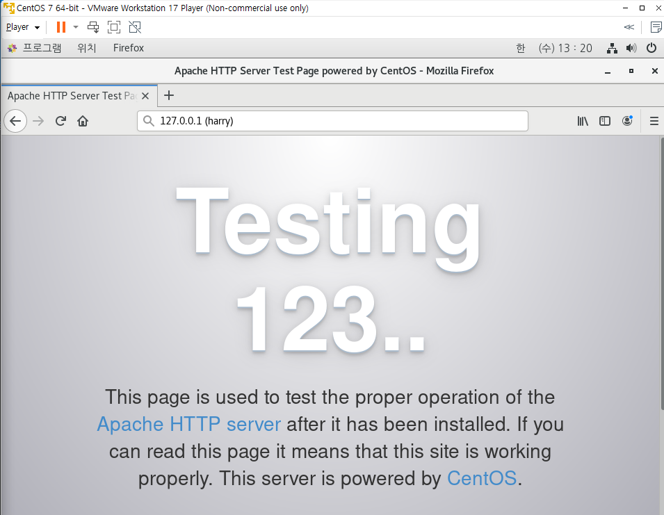

### 8일차
> 이번 주 목표

1. 담당 업무의 회사 생활에 필요한 전반적인 제반사항을 숙지하고 폭 넓은 대인관계를 위한 기틀을 마련
2. 제품 전반에 대한 개념을 습득한다.

    
       2W 멘토링 진행 사항
       인프라 / 네트워크 학습
       기간 : 2023.09.01 까지
       결과 : 2023.09.04 오후에 공유
       Kafka 학습
       기간 : 2023.09.22 까지
       결과 : -
       기타

-----------------------------------------

8일차에 인프라 엔지니어의 교과서(시스템 구축과 관리편)을 정리하는 시간을
가져보았습니다.

7기 동기들과 정리한내용 공유하기 링크는 2주차 > 책 > [인프라 엔지니어의 교과서](https://github.com/JaeKang20/lloydk/blob/main/2%EC%A3%BC%EC%B0%A8/%EC%B1%85/%EC%9D%B8%ED%94%84%EB%9D%BC%EC%97%94%EC%A7%80%EB%8B%88%EC%96%B4%EC%9D%98%EA%B5%90%EA%B3%BC%EC%84%9C.md) 로 남겨놓았습니다.

> 1,2장 [httpd 설치 방법링크](https://veneas.tistory.com/entry/Linux-CentOS7-Apache-%EC%84%A4%EC%B9%98-%EC%95%84%ED%8C%8C%EC%B9%98-%EC%9B%B9-%EC%84%9C%EB%B2%84)
linux 환경에서 systemctl이 안되었는데 apache를 설치하니 해결되었다!

1~2장에서 httpd, nginx, mysql 설치 및 로그가 어디로 저장되는지 살펴보자

### access_log 출력한 화면

### httpd 실행해본 화면

### nginx 실행해본 화면

p.54 엔진엑스 설치할 때 1번의 내용

baseurl=http://nginx.org/packages/centos/6/$basearch/

부분에서 centos/6/ 이 부분이 centos6 버전인거 같아 7로 변경하고 설치했는데 잘 되었습니다.

그리고 nginx 실행시 이전에 설치한 httpd를 중지한 상태에서 실행해야 작동합니다. (시작 및 종료 하는법)

설치를 마쳤으면 시작하는 법은
systemctl start nginx 명령어로 했습니다.

Linux환경에서 Mysql설치해보기

[Mysql 참고 링크](https://dear-sauce-d4e.notion.site/mysql-e49ef2705c144d5b984fcded2d69de31)
    
    # 마침 잘됬다 6일차때 개인공부로 리눅스로 mysql 설치했었는데 1.3이 mysql 부분이었다.

### mysql 쿼리 날린 화면

### mysql 로그

    #로그 저장되는곳
    sudo tail /var/log/mysqld.log

MySQL 로그를 확인하고 분석하려면 다음과 같은 단계를 따를 수 있습니다. MySQL 로그에는 여러 가지 유형이 있으며, 이 중에서도 주요한 로그 유형들을 살펴보겠습니다.

#### 에러 로그 (Error Log):
MySQL의 에러 로그는 데이터베이스 작업 중에 발생한 오류를 기록합니다. 주로 데이터베이스 서버의 문제를 파악하고 해결하는 데 사용됩니다.

#### 쿼리 로그 (Query Log):
쿼리 로그는 MySQL 서버에 실행된 모든 쿼리를 기록합니다. 대규모 시스템에서는 많은 양의 로그가 생성될 수 있어서 성능 이슈를 유발할 수 있습니다. 주로 디버깅 용도로 사용됩니다.

#### 슬로우 쿼리 로그 (Slow Query Log):

슬로우 쿼리 로그는 실행 속도가 느린 쿼리들을 기록합니다. 이를 통해 성능 저하를 일으키는 쿼리를 식별하고 최적화할 수 있습니다.

슬로우 쿼리 로그 파일의 경로와 활성화 여부는 MySQL 설정 파일에서 slow_query_log와 slow_query_log_file 옵션을 확인합니다.

