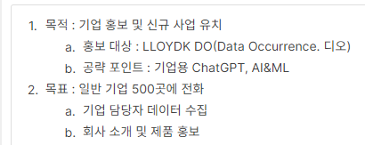

### 7일차
(2023.8.29)

> 이번 주 목표

1. 담당 업무의 회사 생활에 필요한 전반적인 제반사항을 숙지하고 폭 넓은 대인관계를 위한 기틀을 마련
2. 제품 전반에 대한 개념을 습득한다.

     2W 멘토링 진행 사항
     인프라 / 네트워크 학습
     기간 : 2023.09.01 까지
     결과 : 2023.09.04 오후에 공유
     Kafka 학습
     기간 : 2023.09.22 까지
     결과 : -
     기타

#### 그림으로 배우는 HTTP & Network Basic
[최재강 정리 링크](https://github.com/JaeKang20/lloydk/blob/main/2%EC%A3%BC%EC%B0%A8/HTTP%26Network/HTTP.md)

#### 인프라 엔지니어의 교과서 3장

[조성훈님 정리](https://disco-cadmium-738.notion.site/Server-a5e1d00722cf4fb88dd14943202d765d)

--------------

#### 새로 알게 되거나 해본 기능
- Swit카드 깃헙계정 연결

#### 아웃바운드 (오상철 부장님)
 

궁극적 목적
: 1) 현장에서의 임기응변을 높이고 대화를 잘하기 위함.\
2) 로이드케이라는 회사는 어떤 회사인지 알고 있어야한다.

#### 한마디로 대답하는 노력 (정종균 이사님)

* 본인의 미래를 그려보자. (1년 후/ 5년 후/ 10년 후)
* 한마디로 대답하는 노력\
서비스 이중화 잘 돼요? 라는 질문의 의도, (서비스 측면인지, DB측면인지 )
* 한 가지 일을 할 때, 하나의 결과를 얻기보다 두 가지의 결과를 얻으려고 노력해야한다.\
  (Persistance)