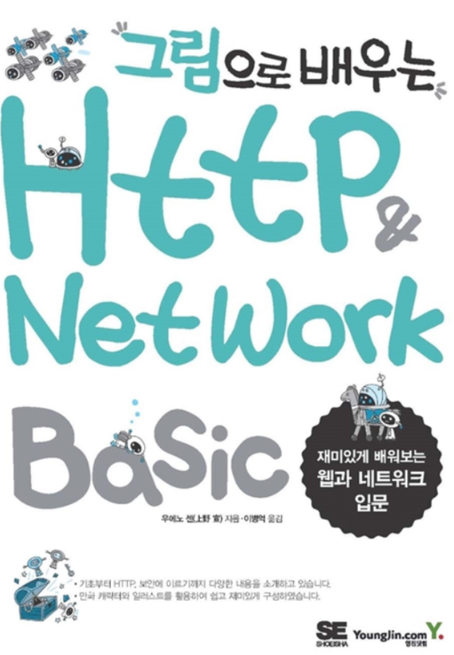
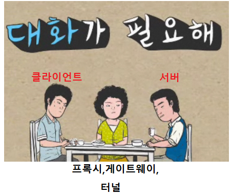
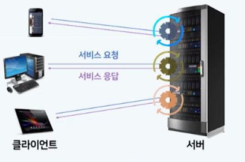
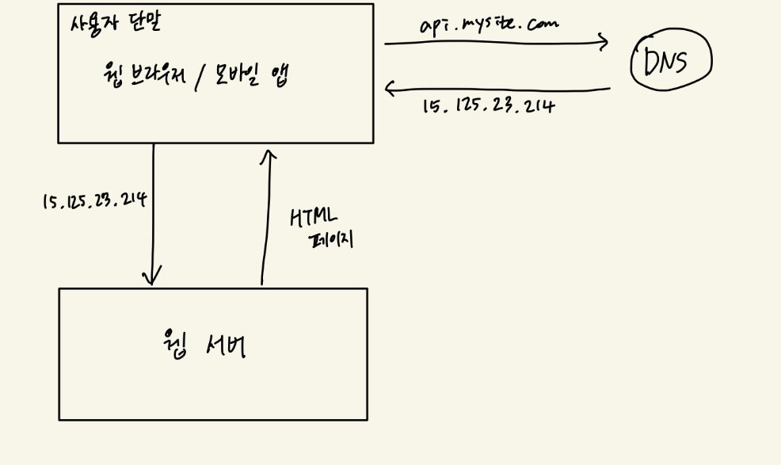
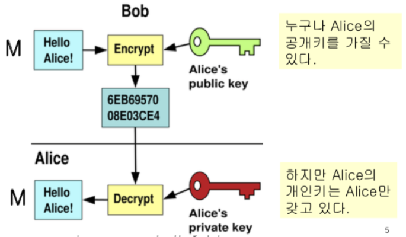

### 그림으로 배우는 HTTP & Network

부제: 대화가 필요해

### 1장 서버와 클라이언트의 대화에 필요한 것들

> 웹 브라우저에 네이버 를 검색하고 화면에 네이버 화면이 출력이 될 때 까지 내부적으로 어떤 동작들이 수행이 되는지 설명해주세요!

서버: 리소스를 가지고 있으며 제공하는 역할\
클라이언트:서버에 의뢰를 하는 웹 브라우저

이런 일련의 흐름을 결정하는게 HTTP라 불리는 프로토콜입니다.

HTTP프로토콜(**약속**)을 이해하기 위해서\
TCP와 IP 프로토콜에 대해 어느정도 알아야 합니다.

네트워크는 TCP/IP 프로토콜에 움직이며 HTTP는 그중 하나입니다.

* 이 책에서는 TCP/IP 자세히 다루지 않고 개념만 설명해준다.

#### TCP/IP 4계층
     애플리케이션 계층 -> DNS,FTP
     트랜스포트 계층 -> TCP/UDP 데이터의 흐름을 제어
     네트워크 계층 -> IP주소
     링크계층: 하드웨어 측면

***TCP/IP를 통한 통신흐름***

| 클라이언트(송신측) | 서버(수신즉)   |
|------------|-----------|
| 애플리케이션 계층  | 애플리케이션 계층 |
| 트랜스포트 계층   | 트랜스포트 계층  |
| 네트워크 계층    | 네트워크 계층   |
| 링크계층       | 링크계층      |

송신측(Request): 계층을 통과할때마다 헤더를 추가\
수신측(Response): 계층을 통과할때마다 헤더를 삭제

keyword: IP, TCP, DNS

IP: 주소를 가짐, 사람이 이해하기 힘듬\
TCP: 소실될 우려 없음 (hand shake), 안전하단 뜻은 아님\
DNS: 인간이 알아볼 수 있는 단어

--------
### 2장 & 3장 간단한 프로토콜 HTTP

* 프로토콜에서 클라이언트와 서버는 무조건 존재하며 한쪽이 결정되면 잘 바뀌지 않습니다.
* 프로토콜은 리퀘스트와 리스폰스로 교환

#### 클라이언트가 보내는 HTTP 프로토콜에는 메서드를 통해 임무를 준다.

| 메서드     | 설명              |
|---------|-----------------|
| GET     | 리소스 취득          |
| POST    | 엔티티 바디전송        |
| PUT     | 파일 전송           |
| HEAD    | 메시지 헤더 취득       |
| DELETE  | 파일 삭제           |
| OPTIONS | 서포트하고 있는 메서드 문의 |
| TRACE   | 경로 조사           |
| CONNECT | 프록시에 터널링 요구     |

#### HTTP는 상태를 유지하지 않습니다.(Stateless), 이전에 보냈던 요청, 응답 기억하지 않는 특징

> 무상태 상황에서 맞닥트리는 문제가 로그인 상태

쿠키
: 쇼핑 사이트에 로그인했을때 누가 로그인했는지 기억해야 하는 상황 발생에서 해결할 수 있는 솔루션

----------
### 4장 결과를 전달하는 코드

서버가 답합니다. 답할때 제공해주는 넘버

| number | 설명         |
|--------|------------|
| 1xx    | 리퀘스트 처리중   |
| 2xx    | 리퀘스트 처리완료  |
| 3xx    | 추가동작 필요    |
| 4xx    | 리퀘스트 이해불가능 |
| 5xx    | 리퀘스트 처리 실패 |

---------
### 5장 멀티 도메인

가상호스트
: 1대의 서버에서 멀티 도메인을 가질 수 있음

통신을 중계
: 프록시, 게이트웨이, 터널

---------

### 6장 HTTP 헤더

평소에는 볼 수 없지만 요청과 응답에 HTTP 헤더와 바디가 존재.

[HTTP메세지 구조]

메세지 헤더
: 클라이언트와 서버 처리에 주요 정보(메서드,URI,프로토콜버전 등)

메시지 바디
: 사용자와 리소스를 필요로 하는 정보 (HTML,CSS...)

[헤더필드의 역할]

HTTP/1.1에 정의되어있는 헤더 필드에는 47종류의 헤더 필드가 있다.

대분류
: 일반 필드, 리퀘스트 필드, 리스폰스 필드, 엔티티 헤더 필드

---------

### 7장  HTTPS
HTTPS는 HTTP가 SSL을 덧씌운 상태

***HTTP의 약점***

    * 평문이기 때문에 도청가능
    * 통신 상대를 확인하지 않기 때문에 위장 가능
    * 완전성을 증명할 수 없기 때문에 변조가능

HTTPS
: HTTP + 암호화 + 인증 + 완전성(변질성x) 보호

### - HTTPS에서 차용한 SSL은 무엇인가?

비대칭키 알고리즘 (공개키 암호화방식이라고도 불림)\
암호화된 키는 공개적이지만 복호화키는 개인키로 있어야 한다.

 
