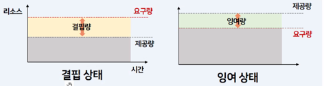

### 인프라 엔지니어의 교과서 (8장)
 

> 클라우드가 등장하기 이전 서버구축을 어떻게 했을까?

온프레미스
: IT 서비스 제공에 요구되는 데이터 센터에 H/W 및 S/W 설비를\
자체적으로 보유하고 운영하는 방식

클라우드 컴퓨팅 기술 나오기 전까지 기업 인프라 구축의 일반적인 방식이다.\
서버 배포는 아주 큰 이벤트였고 배포일에는 사용자가 적은 새벽 시간에 개발자들이 모두 남아 배포 준비를 해야만 했다.

요즈음 금융권 같이 보안을 중요시 하는 곳에서는 아직까지 온프레미스를 사용하고 있다.

[시스템 구축단계]\
요구기능 수집: IT 리소스 요구량 추정 및 추가 리소스 확보\
설계: 구체적 하드웨어 및 소프트 웨어 선정 및 아키텍처 작성\
조달 (입찰): IT 벤더사 선정 및 의뢰, 협상 발주에서 조달까지 2~3주 소요
* 코로나때 5달 걸린적도 있었다고 한다.

구축: 하드웨어 배치 및 연결 테스트, 소프트웨어 설정

운영: 1) H/W, S/W 자산의 관리 및 모니터링, 백업, 시스템 보안 대응\
     2) 시설관리, H/W 임대, 유지 보수, 네트워크 관리, 운영 담당자 인건비 등 부대 비용 발생

단점

-----

## 8장 [Nginx로 이전을 고민하는 당신에게]

1장에서 기본적으로 syslog도 찍어보고, 아파치, 엔진엑스등을 설치하는 방법과\
로그가 저장되는 방법에 대해서 알려줍니다.

하지만 아파치가 대세였던 자리를 완전히 빼앗은 가장 유명한 웹서버이자 오픈소스 소프트웨어입니다.

### 각 웹서버를 비교했을 때 nginx를 도입하는 이유 (특장점)

nginx 도입의 장점으로 **가장 저렴하고 쉽습니다.**

1) 실제로 etc/nginx/conf.d를 보면 줄이 서른한 줄 밖에 되지 않을 정도로 가볍다.

 

2) C10k: 1만 클라이언트 접속 가능
3) 풍부한 OS지원: mac, centos
4) 웹서버, 리버스프록시 뿐 만 아니라 이외의  로드밸런싱, 캐싱, 미디어 스트리밍등 기능까지 제공

### nginx 설치와 기본 설정

nginx 설치
    
        sudo yum install nginx #엔진엑스 설치
        sudo service nginx start #실행 완료인 경우 Starting nginx: [ O K ] 화면 출력

- 웹서버로 nginx 설정확인

- 리버스 프록시 서버로 nginx 이용하기

### 리버스 프록시란?
 외부의 요청을 받아 백엔드 서버로 요청을 전달하는 행위.

프록시는 일반적으로 여러 서버 간에 로드를 분산하고, 다양한 웹 사이트의 콘텐츠를 원활하게 표시하거나, HTTP 이외의 프로토콜을 통해
처리 요청을 응용 프로그램 서버에 전달하는 데 사용됩니다.

[엔진엑스 공식문서](https://docs.nginx.com/nginx/admin-guide/web-server/reverse-proxy/)

    /etc/nginx/conf.d # 기본경로

nginx와 해당 모듈의 작동 방식은 config 파일에서 결정됩니다.

## 클라우드에서 nginx 사용방법

[초보자 가이드 공식문서](https://nginx.org/en/docs/beginners_guide.html)

### aws, ec2에서 nginx 운영

- nginx와 aws를 조합해서 워드 프레스 실행