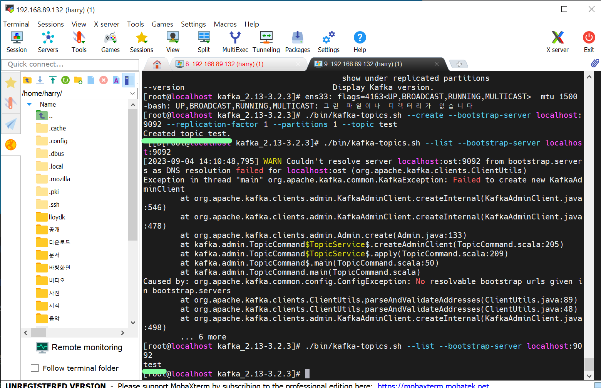

### 11일차
(2023.9.4)

> 이번 주 목표

1. 루틴업무 영역 및 원만한 회사생활을 위한 부수적인 기본사항, 팀내에서 요구하는 사항에 대해서 이해 및 실행능력을 보유한다.

-----------------------------------------

[월요일 오후 발표]

부장님과 다같이 면담(30분~1시간)

내용 - 책을 공부하며 스스로와 동기들에 대해 파악하는 시간을 가진 후 발표하기
뭘 했고 뭘 얻었는지

누가 어떤 스케줄로 어떻게 했는지 등

> 피드백

결과는 시각화해서 전달하는것이 가장 효과적이고\
우리가 대화하는걸 **기록**으로 남기자.

요약 > 디테일 > 마무리가 같이 나왔다면 어땠을까?
상대방이 보여준 모습을 받아들이는 연습을 해야한다.

앞으로 일하게 될 환경이 사람과의 얘기하는게 아니라\
기록으로 얘기해야 할 상황을 맞닥트리게 될 거다.

그리고 현장은 개발환경에서 일하는 사람과 만나고 SQL하는 사람과 만난다.

대화는 수평적으로 일은 수직적으로 하되\
질문과 보고(통보x)는 꼭 해주자.

- 리허설을 해보면 좋다.

### Zookeeper 및 카프카 설치 실행

카프카 정리는 [이 링크](https://github.com/JaeKang20/lloydk/blob/main/Bigdata/kafka.md)

실습 및 설치는 오상철 부장님이 공유해주신 
 
> Kafka_Start_guide_2022 버전 보고 설치하였습니다.

설치이후 나중에 실행할때가 있으면 아래 명령어 실행하면 됩니다.

    cd /usr/local/apache-zookeeper-3.7.0-bin/bin
    ./zkServer.sh start
    ./zkCli.sh
    # zookeeper

    cd /usr/local/kafka_2.13-3.2.3/bin
    ls -l
    ./kafka-server-start.sh
    ./kafka-server-start.sh ../config/server.properties

토픽 생성 및 리스트 확인까지 끝내보았습니다.

토픽 실행한 부분

컨슈머 확인한 부분

  > 주의사항

Duplication Session을 써야 되는 부분이 있다.

### 박민규님 SNS 인물 상태 분석 발표
- Elastice Search 시연(대시보드는 창작의 영역..)

### 아웃바운드 롤플레이

최경진 팀장님 진행