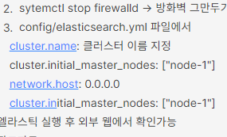
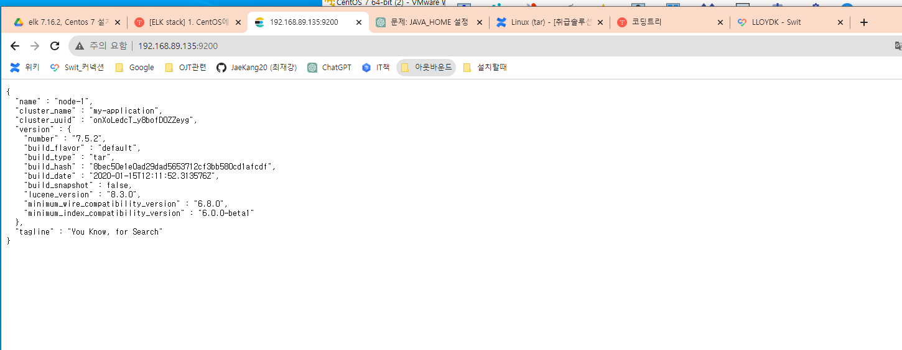

## 13일차
(09.06)

### 가상화 OS 교육 (오상철 부장님)

현재까지 tar형태를 많이 사용한다고 하신다. 컨트롤하기 편하기때문이다.
> 엘라스틱 서치 8버전 이후부터 jdk를 설치하지 않아도 된다.

설치 이전과 설치 이후에 로그 차이는 어떨까?
elasticsearch > bin > config 파일을 보여주셔서

마스터 노드, 네트워크 등등을 짜는 법을 알려주셨다.

> 선배들은 어떻게 했지?

위키 > 솔루션 > 엘라스틱 서치에 대한 내용들을 찾을것!
[참고](https://wiki.lloydk.co.kr/pages/viewpage.action?pageId=7080156)

## 직접 설치해보자!
(yum update를 하고자 한다면 sudoers파일에 대한 권한이 필요하다.[참고링크](https://velog.io/@mer1-97/Error-sudoers-%EC%84%A4%EC%A0%95-%ED%8C%8C%EC%9D%BC%EC%97%90-%EC%97%86%EC%8A%B5%EB%8B%88%EB%8B%A4.-%EC%9D%B4-%EC%8B%9C%EB%8F%84%EB%A5%BC-%EB%B3%B4%EA%B3%A0%ED%95%A9%EB%8B%88%EB%8B%A4))

제일먼저 JDK를 설치해본다.

[참고링크](https://studying-penguin.tistory.com/2)
jdk설치하는게 뭐가 어렵겠냐만은 echo $JAVA_HOME명령어를 확인하고

vi /etc/profile 이 초기화 된 실수가 있었다 이때 chatGPT로 물어보고

아래 명령어로 export JAVA_HOME > /etc/profile명령어를 아래에 추가해줘야 한다.

    #jdk 설치확인(미설치)
    $ javac -version
    -bash: javac: command not found
    
    #설치 가능한 jdk 버전 확인
    $ yum list java*jdk-devel
    Loaded plugins: fastestmirror, langpacks, versionlock
    Determining fastest mirrors
    Available Packages
    java-1.6.0-openjdk-devel.x86_64
    java-1.7.0-openjdk-devel.x86_64
    java-1.8.0-openjdk-devel.i686  
    java-1.8.0-openjdk-devel.x86_64
    java-11-openjdk-devel.i686     
    java-11-openjdk-devel.x86_64   
    java-latest-openjdk-devel.x86_64                                                                               1:14.0.2.12-1.rolling.el7
    
    #jdk 설치
    $ yum install java-1.8.0-openjdk-devel.x86_64
    
    #설치 확인
    $ javac -version
    java-1.8.0-openjdk-devel.x86_64

여기까지 설치 한 이후라면 이제 JAVA_HOME 설정

    $ echo $JAVA_HOME
    
    #javac 경로 확인
    $ which javac
    /usr/bin/javac
    
    #javac 경로를 이용하여 jdk 경로 확인
    #본인 javac 경로를 입력하자. 예시를 그대로 복붙하지 않도록 주의!
    $ readlink -f /usr/bin/javac

자바 HOME설정을 위해 sudo vim /etc/profile 설정

    # /etc/profile

    # 시스템 전반적인 환경 변수 설정
    export PATH="/usr/local/bin:/usr/bin:/bin:/usr/local/sbin:/usr/sbin:/sbin"
    
    # 로케일 설정
    export LANG="en_US.UTF-8"
    export LC_ALL="en_US.UTF-8"
    
    # 시스템 프롬프트 스타일 설정
    PS1='\u@\h:\w\$ '
    
    # 시스템 환경 설정 파일을 로드
    if [ -d /etc/profile.d ]; then
    for profile_script in /etc/profile.d/*.sh; do
    if [ -r "$profile_script" ]; then
    . "$profile_script"
    fi
    done
    fi
    
    # 사용자 지정 환경 설정을 추가할 수도 있음
    # export CUSTOM_VAR="custom_value"
    # <<주석 지우고 export ~~~ > /etc/profile

끝에 export 추가해주면 끝

## 환경설정

    /etc/sysctl.conf
    
    vm.max_map_count=262144
    vm.swappiness=1
    
    /etc/security/limits.conf

    elastic soft nofile 65535
    elastic hard nofile 65535
    elastic soft nproc 4096
    elastic hard nproc 4096
    elastic soft memlock unlimited
    elastic hard memlock unlimited
    ##여기서 elastic말고 본인 계정 아이디 하면 됨

껐다가 다시 켜볼것
ulimit -u

### 방화벽

    방화벽 재실행 : systemctl restart firewalld

    방화벽 상태 확인 : systemctl status firewalld
    
    방화벽 리스트 확인 : firewall-cmd --list-all
    
    방화벽 비활성화 : systemctl stop firewalld

### 엘라스틱 설치 (7.5.2)

sudo yum install wget 명령어 획득이후
   
    wget https://artifacts.elastic.co/downloads/elasticsearch/elasticsearch-7.5.2-linux-x86_64.tar.gz
    tar -zxf elasticsearch-7.5.2-linux-x86_64.tar.gz

위 명령어로 풀게 됨
관리자권한이 아닌 실행자 명령에서

#### *중요 tar 명령어로 zip파일 풀때 관리자 권한으로 풀지 않게 주의!! ll명령어로 확인해서 누구의 권한을 갖고 있는지 확인

7버전까지는 관리자계정으로 엘라스틱으로 할 수 없다

ㅣ
다음은 엘라스틱/config/elastic.yml파일

### 엘라스틱 환경변수

    # on the system and that the owner of the process is allowed to use this
    # limit.
    #
    # Elasticsearch performs poorly when the system is swapping the memory.
    #
    # ---------------------------------- Network -----------------------------------
    #
    # Set the bind address to a specific IP (IPv4 or IPv6):
    #
    network.host: 0.0.0.0
    #
    # Set a custom port for HTTP:
    #
    http.port: 9200
    #
    # For more information, consult the network module documentation.
    #
    # --------------------------------- Discovery ----------------------------------
    #
    # Pass an initial list of hosts to perform discovery when this node is started:
    # The default list of hosts is ["127.0.0.1", "[::1]"]
    #
    #discovery.seed_hosts: ["host1","host2"]
    #
    # Bootstrap the cluster using an initial set of master-eligible nodes:
    #
    cluster.initial_master_nodes: ["node-1"]
    #
    # For more information, consult the discovery and cluster formation module documentation.
    #
    # ---------------------------------- Gateway -----------------------------------
    #
    # Block initial recovery after a full cluster restart until N nodes are started:
    #
    #gateway.recover_after_nodes: 3
    #
    # For more information, consult the gateway module documentation.
    #
    # ---------------------------------- Various -----------------------------------
    #
    # Require explicit names when deleting indices:
    #
    #action.destructive_requires_name: true

cluster.name: test-cluster

node.name: node-1

network.host: 0.0.0.0

:wq + Enter

이렇게 설정해주고 실행하니 잘 되었다

    bin/elasticsearch

아래는 VM이 아닌 mobaxterm에서 실행하여 외부로 돌린 화면이다.

