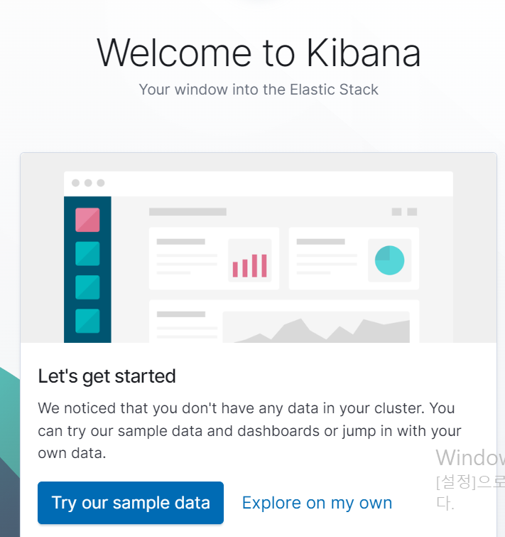
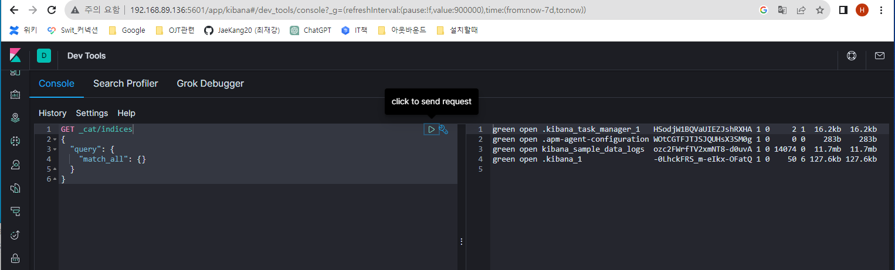
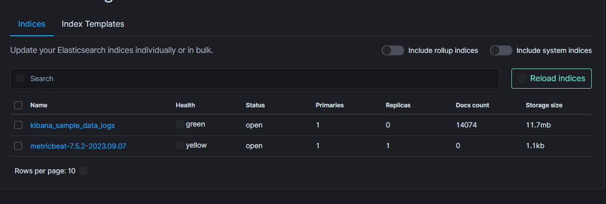
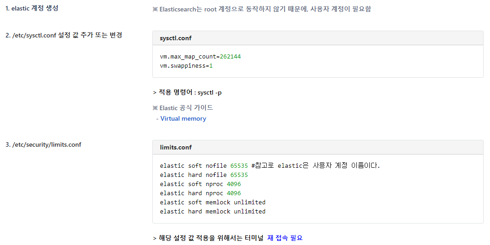

## 14일차
(09.07)

## 키바나, 로그대시
[호환표](https://www.elastic.co/kr/support/matrix#matrix_compatibility)\
[elasticsearch@localhost ~]$ wget\
https://artifacts.elastic.co/downloads/kibana/kibana-7.5.2-linux-x86_64.tar.gz

tar -zxf kibana

    kibana/config/kibana.yml

    server.port : 5601
    
    server.host: "0.0.0.0"
    elasticsearch host  주석 제거
    :wq + Enter

엘라스틱서치 열고 터미널 한개 더 열어서

키바나 실행시키면 됨

시킬때 bin/kibana & 를 하면 백그라운드에서 실행 가능

    jobs
위 명령어는 뒤에서 실행하고 있는 명령어를 알려줌

끌때는 키바나 끌 때 엘라스틱 먼저 끄면 계속 에러 나서 키나바 못 끈다고 함

## 로그스태시
설치 6점대는 6.82가 마지막번호대이다.

    wget https://artifacts.elastic.co/downloads/logstash/logstash-6.8.23.tar.gz
    tar -zxf logstash

그리고 [(엘라스틱 7중반대 버전) 로그스테시 설정파일] output에 host, index 설정만 남겨야 한다고한다.

실행

     bin/logstash -f config/logstash-samplefile.conf &

devtool에서 로그 스태시 실행 확인

### metricbeat

4-1 Metricbeat 다운로드

[elastic@localhost ~] # wget https://artifacts.elastic.co/downloads/beats/metricbeat/metricbeat-8.2.2-linux-x86_64.tar.gz

 > 내가 쓴 버전은 https://www.elastic.co/kr/downloads/past-releases/metricbeat-7-5-2
7.5.2 버전으로 맞추었다.
 

[elastic@localhost ~] # tar -xzf metricbeat-8.2.2-linux-x86_64.tar.gz

[elastic@localhost ~] # cd metricbeat-8.2.2-linux-x86_64

4-2 metricbeat.yml 설정 변경

[elastic@localhost metricbeat-8.2.2-linux-x86_64] # vi metricbeat.yml

수정 내용

elasticsearch output 주석처리

logstash output 주석제거

/elasticsearch output 입력시 해당 단어가있는 줄로 이동 가능

##########Elasticsearch Output#########

#output.elasticsearch:

#hosts: ["localhost:9200"]

##########Logstash Output###########

output.logstash:

hosts: ["localhost:5044"]

:wq + Enter

4-3 metricbeat 실행

[elastic@localhost metricbeat-8.2.2-linux-x86_64] #  ./metricbeat -e

## 엘라스틱 최신 버전 깔아보기 (vmware_centos)

[엘라스틱 8.2.2](https://wiki.lloydk.co.kr/pages/viewpage.action?pageId=3473644)

tar를 통해 실행시키고 먼저 토큰을 받은 상태에서
config/yml 변경해준다음

bin/elasticsearch -d 데몬으로 실행시킨 다음에

curl --cacert config/certs/http_ca.crt -u elastic(슈퍼사용자) https://(본인 IP):9200

비밀번호 토큰 입력하면 됨

