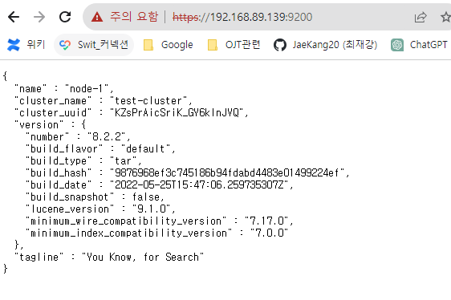
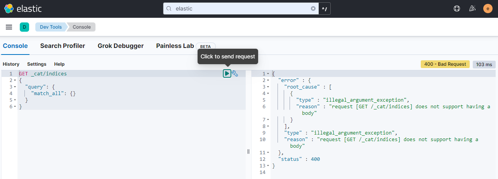
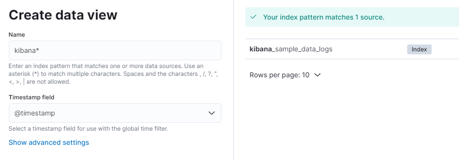

## 15일차
여기서는 https

아이디: elastic

비밀번호: 본인의 비밀번호

### kibana 설치
여기서는 (http:ip번호: 5601)

kibana 설치 후 실행하면 토큰을 입력해야 하는 화면이 있다.
그냥 키바나 실행시 6자리 코드가 뜬다.(이건 따로 메모) 그리고 http접속으로 들어가면 네모난 박스가 나온다.

이 때 터미널에서 bin/elasticsearch-create-enrollment-token -s kibana 를 사용하여

얻어낸 값(엄청 긴 내용)을 복사해서 브라우저에 입력하고 6자리 입력하라는 박스가 뜨면

터미널에 있었던 6자리 코드를 입력하면 된다.
그러면 키바나 설치 끝

### 로그스태시 및 matricbeat는 위키 보고 실행

실행화면

metric beat 설치 이후 적재 확인

Stack management -> [kibana] Data views-> Create Data view
샘플 데이터가 있어야 합니다.

## tar와 rpm 차이
`tar`와 `rpm`은 둘 다 리눅스 시스템에서 소프트웨어 패키지 관리와 관련된 도구입니다

1. **tar (tape archive)**:
    - `tar`는 파일 아카이브를 만들고 추출하기 위한 유틸리티입니다. 주로 여러 파일 및 디렉터리를 하나의 아카이브 파일로 묶는 데 사용됩니다.
    - `tar`는 파일을 압축하지 않고 단순히 파일을 아카이브로 묶거나 해제합니다. 따라서 압축 기능이 없으며, `tar`로 생성한 아카이브 파일은 일반적으로 `.tar` 또는 `.tar.gz`와 같은 확장자를 가집니다.
    - `tar`는 소프트웨어 패키지 관리를 위한 메타데이터나 의존성 관리와는 무관하며, 단순한 파일 및 디렉터리 아카이브 기능을 제공합니다.

2. **rpm (Red Hat Package Manager)**:
    - `rpm`은 리눅스 배포판에서 소프트웨어 패키지를 설치, 업데이트, 제거 및 관리하기 위한 패키지 관리 도구입니다. 주로 Red Hat 계열 및 CentOS와 같은 배포판에서 사용됩니다.
    - `rpm`은 소프트웨어 패키지의 설치 및 관리를 위해 메타데이터와 의존성 정보를 포함하는 패키지 형식을 사용합니다. 이러한 패키지들은 보통 `.rpm` 확장자를 가집니다.
    - `rpm`을 사용하여 패키지를 설치하면 시스템에 필요한 모든 파일을 올바른 위치에 배치하고, 의존성을 해결하여 다른 패키지와의 상호 작용을 관리합니다.

요약하면, `tar`는 파일 아카이브를 만들고 해제하는 데 사용되며, 압축 기능이 없으며 소프트웨어 패키지 관리와는 관련이 없습니다.

반면 `rpm`은 리눅스 시스템에서 소프트웨어 패키지를 관리하기 위한 패키지 관리 도구로, 메타데이터와 의존성 정보를 사용하여 패키지 설치와 관리를 수행합니다.