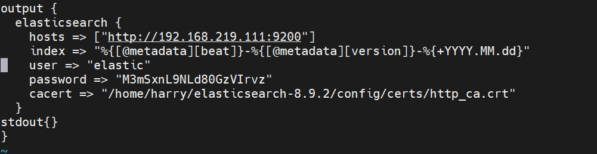

## 17일차
(09.12)

4W 멘토링

    시각화 (공통)
    기간 : 화~수
    목표 : 데이터 색인, 시각화 연습
    데이터 개수 : 9,975
    결과는 채널에 공유
    비고
    더미 데이터
    수집 방법
    Stack 사용 : Filebeat, Logstash
    Kibana 사용 : drag&drop
    개발 : Python 또는 Java
    시각화
    Visualize Library : Cloud Tag +a
    Graphs (Platinum license 필요 → trial 사용)
    시각화 (개인)
    기간 : 목~금
    목표 : 데이터 분석 및 시각화
    데이터 : 개별 준비
    결과 : 설명, 스크린샷 구성으로 ppt 최대 3장 이내로 작성 후 댓글로 등록 (불필요한 장표 생략)
    비고
    작성자
    데이터 출처
    데이터 타입(포멧)
    시각화 주제(목표)
    시각화 결과(설명)

### 5기 박민규님 데이터 시각화 시연
### 오상철 부장님 엘라스틱 클라우드 설명
