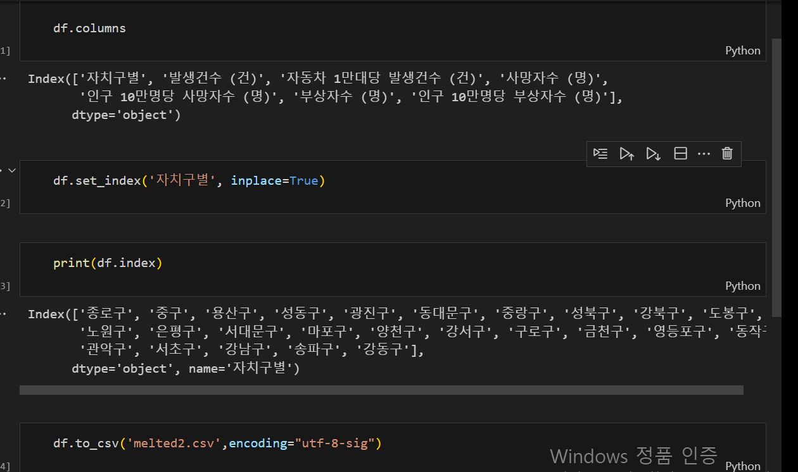
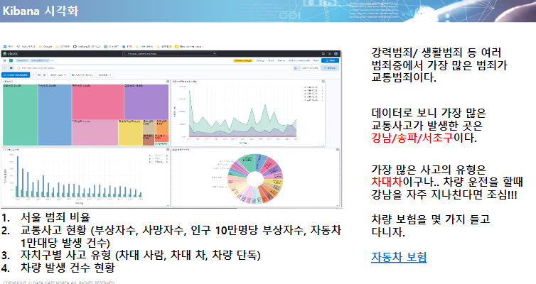

## 21일차
(09.18)

개인 시각화 과제 발표

데이터(csv, json,…) 다운받아서 엘라스틱으로 시각화

python > CSV으로 melted해서 시각화

    import pandas as pd
    df= pd.read_csv("교통사고+현황(구별)_20230916185507.csv",encoding="utf-8")
    
    df.columns # 인덱스를 가져오는 명령어
    
    # 출력결과
    #Index(['자치구별', '발생건수 (건)', '자동차 1만대당 발생건수 (건)', '사망자수 (명)',
    #'인구 10만명당 사망자수 (명)', '부상자수 (명)', '인구 10만명당 부상자수 (명)'],
    #dtype='object')

    df.set_index('자치구별', inplace=True)
    자치구 별을 index하고 원본값을 대체한다.
    
    #Index(['종로구', '중구', '용산구', '성동구', '광진구', '동대문구', '중랑구', '성북구', '강북구', '도봉구',
    #   '노원구', '은평구', '서대문구', '마포구', '양천구', '강서구', '구로구', '금천구', '영등포구', '동작구',
    #   '관악구', '서초구', '강남구', '송파구', '강동구'],
    #  dtype='object', name='자치구별')

    df.to_csv('melted.csv',encoding="utf-8-sig")
    #파일 새로 저장.

판다스와 주피터 노드를 아나콘다를 설치하면 모두 사용 가능해진다.

자치구 별 1씩 카운트 되는 문제는 보는거와 같이 set_index로 해결했으며
colunm이 0부터 안잡히게 되었는데 이는 위 inxdex에서 head명령어를 통해서

colunm을 잡고 시작하였다.

    {
    "종로구": {
    "발생건수 (건)": 974,
    "자동차 1만대당 발생건수 (건)": 154.0,
    ···.
    },
    "중구": {
    "발생건수 (건)": 943,
    "자동차 1만대당 발생건수 (건)": 129.2,
    ···.
    },
    ···.
    }

[시각화 과제 결과](https://docs.google.com/presentation/d/1YbeKztrm9DuwPNGfvv6nSzDVZnhXDKOF/edit#slide=id.p1)

### Redis 발표 -> 다같이 정리 후 지수님 발표

[Redis Zoom meeting 정리](https://docs.google.com/presentation/d/1nFoWhwX5ouac8sPpYSpM10jwU_N0ySQjfxC1E91pTJo/edit#slide=id.g28daa24b522_6_19)

## 머신러닝 공부 (오상철 부장님)

### 어노멀 디텍터 (비지도)_이상 탐지
시간상에서 변화가 있음. 시간축 사용

### 아웃라이어 (비지도)
X축,Y축이 있는 공간이라는 개념에서 튀어나와 있는 애들을 잡아냄

### 클래스피케이션 (지도학습)_구분
경계선 안에서 정해진 내용 안에 벗어난 것들을 알림
답을 알려주고 벗어난 값을 알린다.

### 레그리션 (지도)_회기
예측 범위에 가깝다. 분포도를 활용 과거의 값을 통해 미래를 예측(주식)