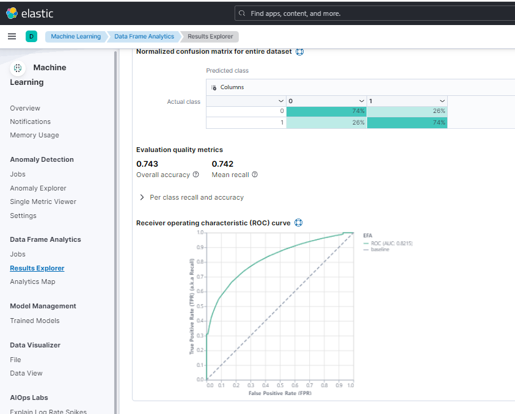

## 22일차
(09.18)

section5[바로가기 링크](https://drive.google.com/drive/folders/11EbJ13ArA9B7tdu-pNoPmrxtUdE8RqiL)

2020~2022년 작년 7월말까지의 데이터 (서비스센터의 차량데이터)

* 컬럼별 설명도 달아놨음
* EFA란? 유상옵션 적용 유무

이 데이터를 학습해서 2022년 07월 EFA 옵션을 적용했을까 안해놨을까를 예측해보고 상관관계 분석(추론)해본다.
* Hint!) 7월달거 잘라서 사용하면 된다. 차대 번호로는 원하는 값을 얻어서 쓸 수 없다.

PPT 3장 분량으로 만들것

### 필요없는거는 지우고 머신러닝 해보자.
> 데이터 전처리

    import pandas as pd
    
    df = pd.read_excel(r'C:\Users\lloydk-dahye\workspace\1_elastic_prj\3_machine_learning\202208_rosa_training.xlsx')
    df
    
    from datetime import datetime
    
    df['DATE'] = df['RO'].str.extract(r'(\d{4}-\d{2}-\d{2})') #정규식 datetime 형식 맞는것 빼냄
    df['DATE'] = pd.to_datetime(df['DATE']) # 새로운 열 만듦
    
    
    
    1.
    ```
    df['EFA'] = (df['EFA'] == 'EFA').astype(int)
    ```
    
    #`df['EFA'] == 'EFA'`: `EFA`라는 열의 각 값이 'EFA' 문자열과 동일한지 비교합니다. 이 연산의 결과는 각 행에 대한 부울(Boolean) 값(True 또는 False)이 됩니다.
    # `.astype(int)`: 부울 값을 정수형으로 변환합니다. 여기서 True는 1로, False는 0으로 변환됩니다.
    # `df['EFA'] = ...`: 이 변환된 결과를 다시 원래의 `EFA` 열에 할당합니다. 따라서, 원래의 `EFA` 열의 값들은 'EFA' 문자열인 경우 1로, 그렇지 않은 경우 0으로 변경됩니다.
    
    2.
    ```
    df['CHARACTERISTICS'] = df['VIN'].str[3:9]
    ```
    #이 코드는 `VIN` 열의 각 문자열 값에서 4번째 문자부터 9번째 문자까지의 부분 문자열(substring)을 추출하여 새로운 `CHARACTERISTICS` 열을 생성하거나 기존 열을 업데이트합니다. (Python에서의 인덱싱은 0부터 시작합니다.)
    
    3.
    ```
    df['MODEL_YEAR'] = df['VIN'].str[10]
    ```
    #이 코드는 `VIN` 열의 각 문자열 값에서 11번째 문자를 추출하여 `MODEL_YEAR`라는 새로운 열을 생성하거나 기존 열을 업데이트합니다.
    
    #결론적으로, 이 코드들은 주어진 DataFrame의 특정 열들을 기반으로 새로운 정보를 추출하거나 기존 정보를 변환하는 작업을 수행합니다.
    
    new_df = df.drop(columns=['12V', 'TIRE', 'Air Care', 'RO']) #열 없애기
    
    new_df.to_csv('rosa_pre_data.csv', encoding='utf-8', index=False)
    
    new_df.info()

> [머신러닝_가천대 ](https://docs.google.com/presentation/d/19Wp9PUeqkt2YPH3fZeKa44LZ7fvMAbUm/edit#slide=id.p57)

> [머신러닝 필드 선택할 때](https://www.elastic.co/guide/en/machine-learning/current/ml-metric-functions.html)

머신러닝은 클라우드나 30일 트라이얼을 동의해야 사용 가능하다.



머신러닝 > 데이터프레임 분석 > 결과 탐색

이상탐지, 아웃라이어, 클래스피케이션, 레그리션 네가지중에서

classfication이용했다.

## 새로알게된 사실

종속변수, 독립변수 차이


 

