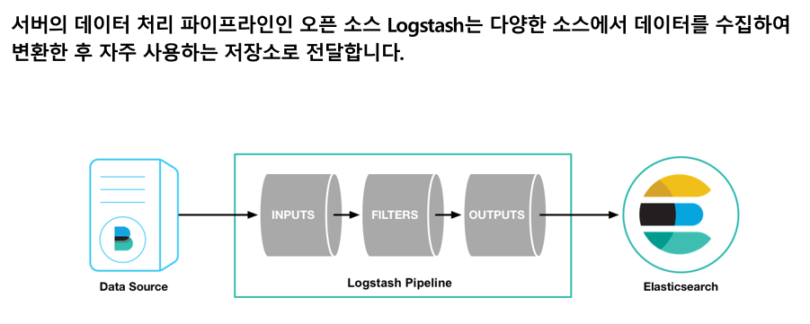

## 23일차
(09.20)

### 카프카 정리

카프카 기본 개념 구조

주키퍼 > 상터 점검하며 메타데이터 저장하는 역할

카프카는 여러대의 브로커를 구성한 클러스터\
클러스터는 서버, 노드 의미

### 프로듀서, 컨슈머 정리
프로듀서: 카프카로 보내는 클라이언트
컨슈머: 카프카에서 꺼내는 클라이언트

뭘 보내냐? 토픽이다. (메시지 피드 의미)

메시지: 로그 또는 로그 메시지라고 불림

### 리플리케이션(복제본)
팩터(요소)로 구분
테스트 후 환경은 1, 운영환경은 2 또는 3, 4~5도 가능

### 병렬 처리
특징: 파티션을 0부터 생성\
옵션으로 생성할 수 있으며 주의사항은 한 번 늘린 파티션 수는 절대 줄일 수 없다.

LAG를 계산해서 모니터링 하는 방법이 있다(프로듀서가 보내는 메시지 수 - 컨슈머가 가져간 메시지 수)

### 컨트롤러
ISR 리스트에 저장 (주키퍼)
컨트롤러 -> 브로커가 실패하는걸 예의주시 ->
실패시 새로운 파티션에 리더로 선출

파티션 리더가 다운됬다 -> 리더가 없다 > 읽기와 쓰기 동작 안한다는 의미
1개의 파티션 선출 작업 0.2초가 걸리면\
1만개의 파티션은 2000초가 걸리고 30분 넘는 시간동안 작동 x

1.1.0버전 부터 큰 개선 이뤄냄

확인 경로
    
    controlled.shutdown.enable = true

### 로그 세그먼트

파티션 0에 저장된 로그

    data/kafka logs

### 카프카 운영과 모니터링
안정적인 모니터링
카프카 뿐 아니라 하드웨어의 리소스도 모니터링 해야한다 (그라파나, 프로메테우스) 기반으로 모니터링

초기 실행시에 고려할 사항 매우 많다. -> 버그가 자주 일어난다.

#### 안정적인 운영을 위한 주키퍼와 카프카 환경 구성
향후 일년 안에는 설치하지 않을 수 도 있다.

| 주키퍼                                 | 카프카                                                                             |
|-------------------------------------|---------------------------------------------------------------------------------|
| 서버수량(min 3)                         | 서버수량(반드시 홀수일 필요는 없다, min3                                                       |
| 하드웨어  (min memory4GB, disk240GB)    | 하드웨어      (memory 사용률 매우 높은 편(32gb권장), JVMheap크기 최소6gb, 네트워크는 사용량 비율 50%넘지 않도록) |
| 배치                 (aws 인스턴스 2개,3개) | 배치 (가용영역 여러 대)                                                                  |

### 모니터링 시스템 구성

로그 수집 및 분석은 [카프카, 데티어 플랫폼의 최강자] 7장 엘라싁 서치등을 이용한 방법

카프카에서 Kafka/Config/log4j.properties 로그 레벨을 지정해줄 수 있다.\
로그 확인은  Kafka/logs/server.log

표 P.223
TRACE, DEBUG, INFO, WARN, ERROR, FATAL

WARN은 경고수준,
ERROR는 경고수준 넘어선 런타임 에러 의미

## 데이터 수집
서팀장님 사용툴

- 리눅스 명령어 단축키 잘 알고 있어야한다.
- Everything > 윈도우 탐색기보다 훨씬 빠름.
- Q_dir 복붙 편하게 보는 창
- dbever

 notepad plus plus 메모
 pythond은 vscode

### Database
디비는 집합이다!

DML을 많이 쓰게 될것(우리가 DB를 짜주지는 않으니까)
셀인업뎃

뷰 = 리드만 가능 *엘라스틱에서 Alias이다.

### Logstash란?
[로그스태시 참고링크](https://blog.bizspring.co.kr/%ED%85%8C%ED%81%AC/logstash-%EC%8B%A4%EC%8B%9C%EA%B0%84-%EB%8D%B0%EC%9D%B4%ED%84%B0-%EC%88%98%EC%A7%91-%ED%8C%8C%EC%9D%B4%ED%94%84%EB%9D%BC%EC%9D%B8/)
인덱스를 추가해볼 수 있다.

full_search_product.conf

[Logstash공식가이드](https://www.elastic.co/guide/en/logstash/current/logstash-settings-file.html)

ETL 작업을 한다.

jdbc 플러그인사용

pipline.yml로 파이프라인 확인해볼 수 있다.

? du -sh 명령어?

### elasticsearch
[실제 적용한 사이트](https://shop.atomy.com/)

바로바로 확인 가능

DB와 elastic차이
- 한 필드의 두개가 들어간다.
- 필드안에 필드로 구분이 가능하다 

이유: JSON을 사용

진행방법: DBevear 설치 dbeaver-ce-23.2.0-x86_64-setup.exe

회사 **NAS 접속 후 DB,LS 파일 압축 푼 후에 C드라이브** 에사용

### 1,2번 답
[sql 정리 참고내용](https://github.com/JaeKang20/lloydk/blob/main/5%EC%A3%BC%EC%B0%A8/SQL.txt)

## 데이터 기반 과업 지시서 -> 오상철 부장님 교육
프로젝트를 어떻게 진행하는지?

