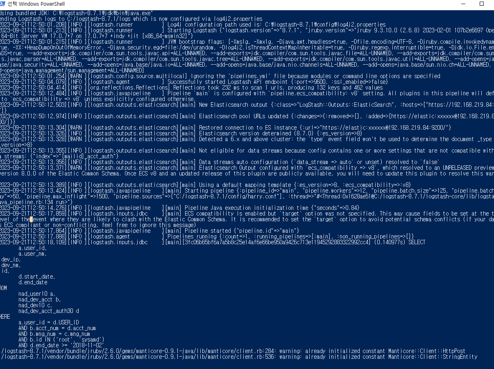
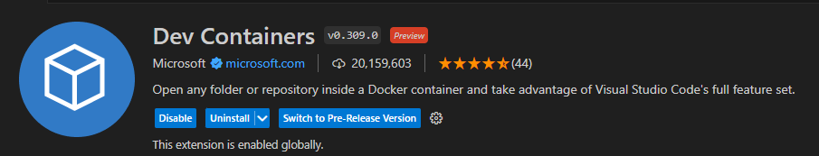
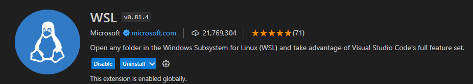
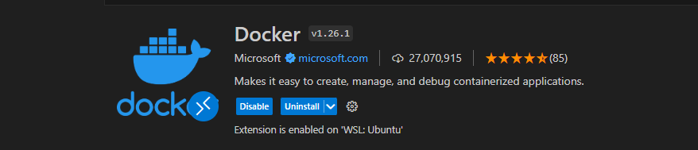

## 24일차
(09.21)

### 서진환팀장님 교육 3번문제 해결해보기

C:드라이브 앞에 놓을것

처음에는 교육중에 ftp를 언급하신게 생각나서 VM위에 띄워놓은 걸로
오라클 드라이버와 쿼리파일을 넣고 conf파일도 직접 만들어서 해보았는데 잘 되지 않았습니다.

>>>동기분들이 중요한 함수는 그대로 넣는게 좋다고 생각되서 그냥 주신 파일로 해보라고 해서
>>>방법을 바꾸었고 팀장님이 주셨던 파일에 경로값만 일부 수정하니 잘 되었습니다.

하던 도중에 알게 된 사실은 sql파일안에 ~~한국어가 있으면 안된다~~(안되는줄 알았는데 이건 아니라고 하심),\
**세미콜론(;)이 있으면 안된단** 사실이었습니다.

\
완료한 화면

#### 아웃바운드 5건 진행

### 카프카 진행상황

현재 9.13까지 정독 완료

1) kafka-topics.sh --version #버전확인하는 법 명령어 또는
2) kafka/libs/ ls -l 명령어

버전 업을 할 때 카프카 브로커 종료하는 법

1) 브로커 접속
2) usr/local 경로
3) 브로커 종료
4) kafka 관련 링크 삭제
5) 버전업 재생성
6) 설정 파일 복사 또는 옵션 설정
7) 브로커 시작

**_주의사항_**
    
작업시간이 적은 시간 활용, 롤링 재시작으로 인한 메시지 손실 (극히 일부 상황)

## WSL 설치 및 우분투 설치

wsl --install

wsl --install -d ubuntu # ubuntu 설치명령어\
이후

VScode에서

dev containers 설치 후

wsl 설치 하고

docker 설치하면

vscode에서 docker 사용할 수 있다.

### Docker desktop 설치

wsl을 설치하고 window용을 설치하여 완료하였다.