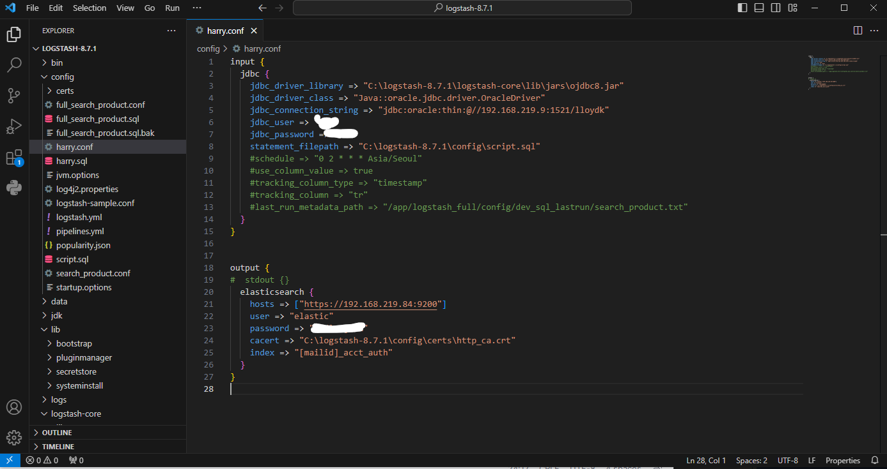

## 24일차
(09.21)

### 서진환팀장님 교육 3번문제 해결해보기

C:드라이브 앞에 놓을것

처음에는 교육중에 ftp를 언급하신게 생각나서 VM위에 띄워놓은 걸로
오라클 드라이버와 쿼리파일을 넣고 conf파일도 직접 만들어서 해보았는데 잘 되지 않았습니다.

>>>동기분들이 중요한 함수는 그대로 넣는게 좋다고 생각되서 그냥 주신 파일로 해보라고 해서
>>>방법을 바꾸었고 팀장님이 주셨던 파일에 경로값만 일부 수정하니 잘 되었습니다.

하던 도중에 알게 된 사실은 sql파일안에 ~~한국어가 있으면 안된다~~(안되는줄 알았는데 이건 아니라고 하심),\
**세미콜론(;)이 있으면 안된단** 사실이었습니다.

\
완료한 화면

#### 아웃바운드 5건 진행