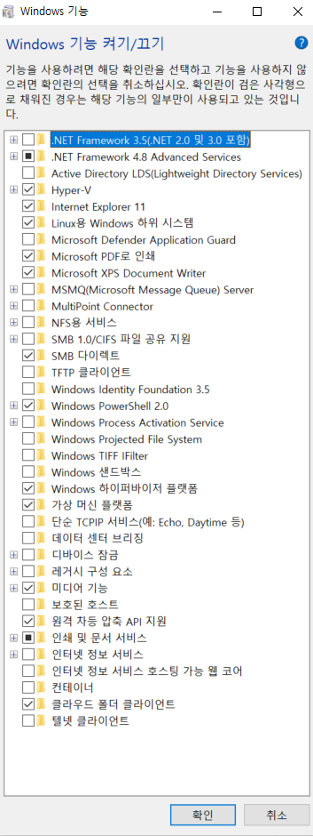

## 26일차
(09.25)

## [ada 정성평가](https://docs.google.com/spreadsheets/d/1Zet44Qir8D_uNZhyJMgyQ9hjC5sBpbjP/edit?usp=sharing&ouid=108430094174522716965&rtpof=true&sd=true)

## 카프카
### ssl 카프카 암호
디렉토리 <SSL> 구성 후 저장

클라이언트: 트러스트 스토어
서버: 키스토어에 저장

CA인증서: 추가해도 되는데 비용이 발생함.

확인은 ssl기반 메시지 전송함으로 확인

### 커버로스를 이용한 카프카 인증
(SASL) 티켓 발급받으면 싱글사인 온 방식으로 여러 서비스에 인증됨

키 탭을 이용한 인증 방식도 있음

### 권한 설정 (브로커)

Server.properties 파일 수정
슈퍼유저 설정: 어드민, 카프카

### 에이브로 지원해주는 카프카
에이브로는 JSON형태로 생각하면 된다.

## WSL 설치 구성 정리

[wsl 설치](https://xpectation.tistory.com/166#--%--%EB%A-%BC%EC%A-%--%--BIOS%EC%--%--%--%EC%A-%--%EC%-E%--%ED%--%--%EC%--%AC%--CPU%EC%-D%--%--%EA%B-%--%EC%--%--%ED%--%--%--%EA%B-%B-%EB%-A%A-%EC%-D%--%--%EC%BC%-C%EC%-E%---)

