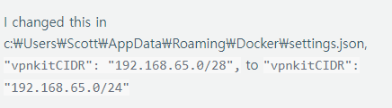

## 27일차
(09.26)

wsl 이 정지되었다면 위와 같은 방법으로 재실행 해보자.

만약 도커가 문제로  도커 실행하면 데스크탑이 실행되지 않는 문제

위 경로의 파일로 Json을 편집해주자.

Json 본문은 아래 링크 참고
### [setting.json 본문](https://docs.docker.com/desktop/hardened-desktop/settings-management/configure/)

