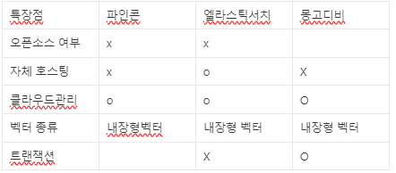
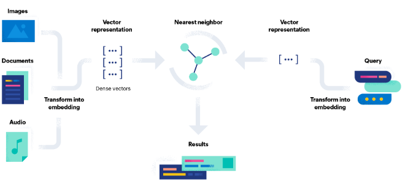

## 33일차
(10.11) 자료조사

- 목록
    - 비교
        - 디비별 벡터화 모델에 대한 호환성
        - 기능 및 특징(표)
    - 디비별 벡터서치에 관한 기능 및 특징 조사

- 기능 및 특징 비교

    | 특장점 | 파인콘 | 엘라스틱서치 | 몽고디비 |
    | --- | --- | --- | --- |
    | 오픈소스 여부 | x | x |  |
    | 자체 호스팅 | x | o | X |
    | 클라우드관리 | o | o | O |
    | 벡터 종류 | 내장형벡터 | 내장형 벡터 | 내장형 벡터 |
    | 트랜잭션 |  | X | O |

- 엘라스틱서치

  ([공식문서 출처](https://www.elastic.co/kr/what-is/vector-search))

  가장 큰 장점은 벡터 임베딩을 지원해줍니다. 임베딩을 생성하는 모델은 더 관련성이 높고 정확한 결과를 제공하기 위해 수백만 개의 예제를 사용해 훈련됩니다.

  이는 문서, 이미지, 오디오 등 다양한 유형의 데이터를 **경우에 따라 문서의 주요 기능을 나타내기 위해 수집하거나 엔지니어링한 숫자 데이터를 임베딩으로 사용**할 수 있습니다. 필요한 것은 효율적으로 검색할 수 있는 기능입니다.

  벡터 데이터베이스, *시맨틱 또는 [코사인 검색*으로 알려진 벡터 검색 엔진](https://skagh.tistory.com/32)은 주어진(벡터화된) 쿼리에서 최근접 이웃을 찾습니다.

  기존 검색이 언급된 키워드, 어휘 유사성 및 단어 발생 빈도에 의존하는 반면, 벡터 검색 엔진은 임베딩 공간의 거리를 사용하여 유사성을 나타냅니다. 관련 데이터를 찾는 것은 쿼리의 최근접 이웃을 검색하는 작업입니다.

  ### 특징

    1. **[내장형 벡터](https://www.elastic.co/kr/blog/how-to-deploy-nlp-text-embeddings-and-vector-search)**

  엘라스틱의 경우, **[Hugging Face](https://huggingface.co/)**의 **[msmarco-MiniLM-L-12-v3](https://huggingface.co/sentence-transformers/msmarco-MiniLM-L-12-v3)**을 사용합니다. 이것은 문장이나 단락을 가져와서 **384차원의 밀집 벡터**에 이를 매핑하는 Sentence Transformer 모델입니다.

    1. [**유사성 점수**](https://www.elastic.co/kr/blog/text-similarity-search-with-vectors-in-elasticsearch)

  사용자가 짧은 자유 텍스트 쿼리를 입력하면 쿼리와의 유사도에 따라 문서 순위가 매겨집니다. (hit)

    1. [**ANN**](https://www.elastic.co/kr/what-is/vector-search)

  k-최근접 이웃 알고리즘(kNN)과 같은 기존의 최근접 이웃 알고리즘은 실행 시간이 과도하게 길어지고 컴퓨팅 리소스를 빠르게 소모합니다. **ANN은 고차원 임베딩 공간에서 대규모로 효율적으로 실행하지만, 대신 정확도가 감소**합니다.