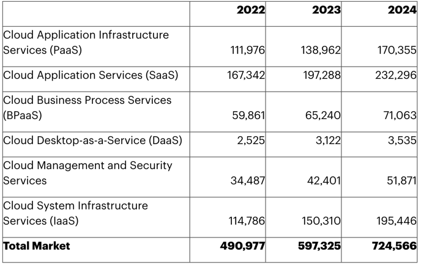

### 클라우드 컴퓨팅 시장

단위: 100만달러, 2023년에 6천억 달러 지출 우리나라 돈으로 780조

출처: [Gartner](https://www.gartner.com/en/newsroom/press-releases/2023-04-19-gartner-forecasts-worldwide-public-cloud-end-user-spending-to-reach-nearly-600-billion-in-2023)

다양한 유형의 신규 컴퓨팅 리소스 도입 및 증설/ 감축에 대한 요구가 증가함
 * 대규모 데이터 센터의 집중화된 리소스를 기반으로 인터넷상에서 필요에 따라 원하는 만큼 컴퓨팅 리소스를 사용할 수 있는 클라우드 
컴퓨팅 기술의 중요성이 대두된다.

 * 하지만 그에 비해서 전문 인력 부족하며 클라우드 비용관리가 많이 드는 단점이 있다.

------
### 클라우드 컴퓨팅에는...
가상화, 프로비저닝, 서버리스 컴퓨팅, 로드밸런싱, 오토스케일 기술 등 클라우드 컴퓨팅 활용에 필요한 이론 및 기술들 존재

클라우드 서비스화를 위한 서비스 모델, 배포모델, 아키텍처 및 보안과 프라이버시에 대하여 학습
