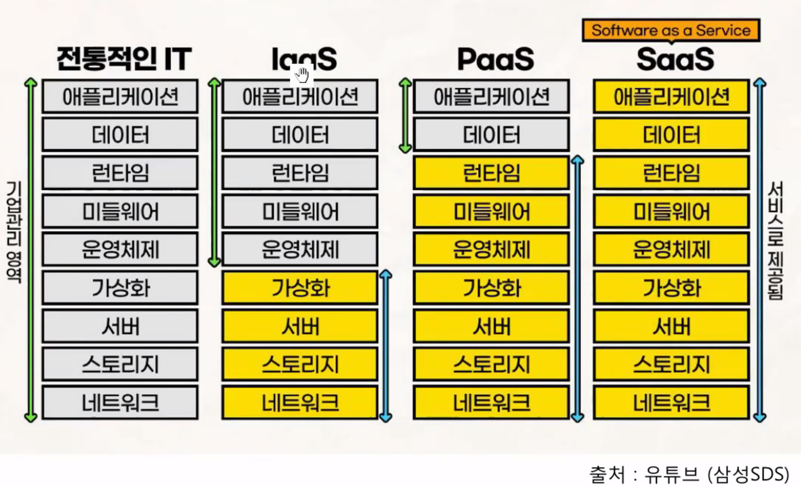

## 클라우드 컴퓨팅

### 2번
클라우드 컴퓨팅 서비스 모델을 분류하고 각각에 대해 설명하시오

클라우드 컴퓨팅에서IaaS와 PaaS, SaaS순으로 서비스가 확장되어 제공됩니다.\
마치 짜장면을 먹는것과 비교해서 알려드리겠습니다. 먼저 가장 낮은 단계인 IaaS부터 살펴보겠습니다.

IaaS는 InfraStructure as a Service의 약자로 소비자에게 제공되는 부분이 \
컴퓨팅, 스토리지, 네트워킹(호스트 방화벽), 가상화와 같은 주문형 인프라 리소스를 제공하는 클라우드 서비스 모델입니다.

IaaS는 짜장면을 만들기 위해 필요할 주방과 원재료를 제공해주는 것과 같습니다.
사용자는 모든 단계를 직접 관리하며 응용프로그램까지 설치 및 관리합니다.

다음은 PaaS입니다. PaaS는 Platform as a Service의 약자입니다.\
마치 짜장면을 만들기 위해서 레시피와 조리 도구를 제공 받는것과 같습니다.\
개발자는 요리 레시피를 따르고 플랫폼은 하부 인프라를 관리 처리합니다.

여기서 개발, 배포, 실행, 관리할 수 있는 유연하고 확장 가능한 클라우드 플랫폼을 제공합니다.\
운영체제와 개발 도구를 따로 업데이트하거나 하드웨어를 유지보수할 필요도 없습니다.\
기업등에서 새로운 앱을 개발하거나 호스팅하기 위해 하드웨어, 소프트웨어를 업데이트, 설치해야 할 비용을 줄이는데 도움을 줄 수 있습니다.\
개발자는 애플리케이션 코드에 좀 더 집중할 수 있겠죠?

클라우드 컴퓨팅 서비스 단계에서 가장 높은 단계에 위치한 건 SaaS인데요.

짜장면으로 치면 배달 서비스를 제공해준다고 생각하시면 됩니다.\
요리를 만드는 과정을 걱정하지 않고 단순히 짜장면을 먹으면 됩니다.\
사용자는 요리를 준비하거나 조리하는 데 거의 관여하지 않습니다.

SaaS는 Software as a Service의 줄임말로, 고객은 컴퓨터에 소프트웨어를 설치할 필요가 없습니다.

이 모델에서는 구독 방식(Subscription)으로 운영되어 라이선스가 부여됩니다.

\

### 온프레미스 환경의 시스템을 클라우드 시스템 환경으로 전환을 검토할때 고려해야 할 점들을 기술

시스템 클라우드는 보안이 취약한 부분이 있다고 합니다.

