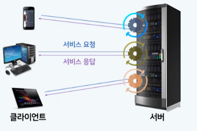

## 클라우드 컴퓨팅 이해
이에 앞서... 

[OT](https://github.com/JaeKang20/lloydk/blob/main/%ED%81%B4%EB%9D%BC%EC%9A%B0%EB%93%9C/OT.md)
>클라우드 컴퓨팅의 개념 및 정의 - 컴퓨팅 기술 발전의 역사 - 클라우드 컴퓨팅의 등장 배경 - [실습] MS 계정 및 Azure 구독 발급

-----

### 클라우드 컴퓨팅의 개념 및 정의
06년대~07년대 논문에서 처음 등장한 '클라우드'개념
- 가트너 선정(IT컨설팅하는 주요 기업) 2023년 10대 전략 기술 중\
4번째, 산업 클라우드 플랫폼이 있다. (Industry Cloud Platforms)

#### 클라이언트와 서버의 대화

[참고링크](https://github.com/JaeKang20/lloydk/blob/main/2%EC%A3%BC%EC%B0%A8/HTTP%26Network/HTTP.md)
우리는 클라이언트가 아닌 '서버'에 주목해본다.

서버가 좋은 서비스를 가지려면 큰 용량을 가져야하는데 클라우드가 이를 해결해주기 때문에
대중화에 기여를 하였다.

#### 2. 클라우드 컴퓨팅의 개념

| 클라우드                     | 컴퓨팅                                         |
|--------------------------|---------------------------------------------|
| 즉시성,유연성,확장성 가용성, 보안성 | 서버, 저장장치,DB,네트워크, 이메일,보안, 백업,복구 등의 기업용 소프트웨어 |

1) 클라우드 컴퓨팅을 이용한다라고 하면 몇 번의 클릭만으로 심지어는  5분 이내에서도 실제 새로운 서버를 구축해서 사용할 수가 있게 됩니다.
2) 그리고 컴퓨팅 장치의 문제가 생긴다 하더라도 다른 컴퓨팅 자원으로 즉시 대체 가능합니다.

3) 고속의 컴퓨팅 장치를 구입을 해 놓고 만약에 이게 사용되지 않는다라고 하면 기업 입장에서는
굉장히 큰 비용을 낭비하고 있는 것이다 라고 할 수가 있죠.

>    마치 택시처럼 사용한 이동한 거리 만큼 비용을 지불한 것 같이
> 사용한 만큼만 비용을 지불할 수 있도록 만들어 놓은 그런 형태의 기능이 바로 클라우드 컴퓨팅에 특징

